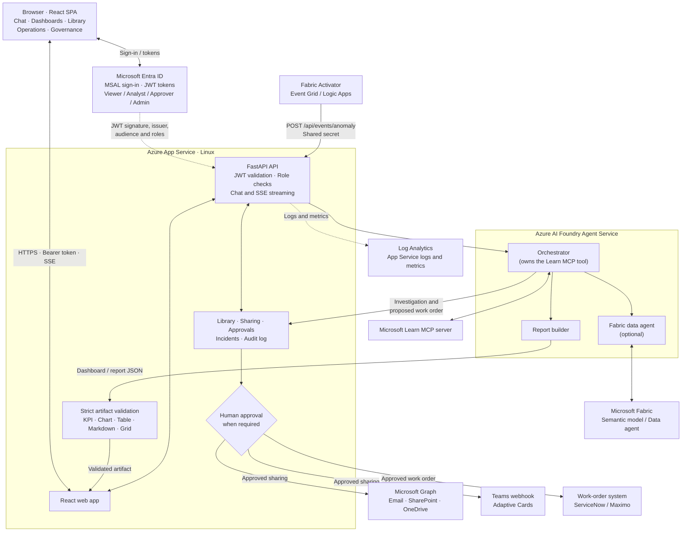

# Foundry Analyst architecture

```mermaid
flowchart TB
    User["Browser · React SPA<br/>Chat · Dashboards · Library<br/>Operations · Governance"]
    Entra["Microsoft Entra ID<br/>MSAL sign-in · JWT tokens<br/>Viewer / Analyst / Approver / Admin"]

    subgraph App["Azure App Service · Linux"]
        Web["React web app"]
        API["FastAPI API<br/>JWT validation · Role checks<br/>Chat and SSE streaming"]
        Validation["Strict artifact validation<br/>KPI · Chart · Table · Markdown · Grid"]
        Governance["Library · Sharing · Approvals<br/>Incidents · Audit log"]
        Approval{"Human approval<br/>when required"}
    end

    subgraph Foundry["Azure AI Foundry Agent Service"]
        Orchestrator["Orchestrator<br/>(owns the Learn MCP tool)"]
        FabricAgent["Fabric data agent<br/>(optional)"]
        ReportBuilder["Report builder"]
    end

    Fabric["Microsoft Fabric<br/>Semantic model / Data agent"]
    Learn["Microsoft Learn MCP server"]
    Graph["Microsoft Graph<br/>Email · SharePoint · OneDrive"]
    Teams["Teams webhook<br/>Adaptive Cards"]
    WorkOrders["Work-order system<br/>ServiceNow / Maximo"]
    Events["Fabric Activator<br/>Event Grid / Logic Apps"]
    Monitor["Log Analytics<br/>App Service logs and metrics"]

    User <-->|"Sign-in / tokens"| Entra
    User <-->|"HTTPS · Bearer token · SSE"| Web
    Web <--> API
    Entra -.->|"JWT signature, issuer,<br/>audience and roles"| API

    API --> Orchestrator
    Orchestrator --> FabricAgent
    Orchestrator --> ReportBuilder
    FabricAgent <--> Fabric
    Orchestrator <--> Learn
    ReportBuilder -->|"Dashboard / report JSON"| Validation
    Validation -->|"Validated artifact"| Web

    API <--> Governance
    Governance --> Approval
    Approval -->|"Approved sharing"| Graph
    Approval -->|"Approved sharing"| Teams
    Approval -->|"Approved work order"| WorkOrders

    Events -->|"POST /api/events/anomaly<br/>Shared secret"| API
    Orchestrator -->|"Investigation and<br/>proposed work order"| Governance

    API -.->|"Logs and metrics"| Monitor
```
